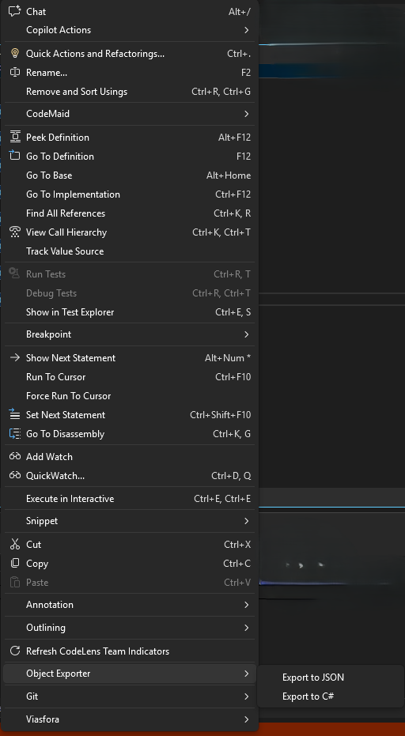
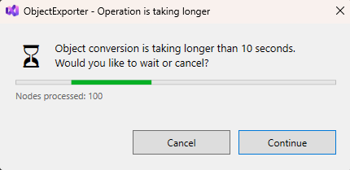

# ObjectExporter — Visual Studio Debug Object Exporter (JSON & C#)

[](https://opensource.org/licenses/MIT)


Export any debug‑time object into **JSON** or **C#** with a single right‑click.  
ObjectExporter enhances Visual Studio debugging by instantly generating JSON views or C# schema representations of any object when execution is paused at a breakpoint.

> **New in Version 3.0.0:** Smart timeout with cancel dialog to prevent Visual Studio freezing on large object graphs.

---

## 📺 Video

<a href="https://youtu.be/M8qHN3kuWbo">
  
</a>

---

## ✨ Features

*   **Right‑click export while debugging**  
    When the debugger is paused, right‑click any object identifier → **ObjectExporter** → **Export to JSON** or **Export to C#**. Now also works from **Autos / Locals / Watch** panels (since v2.4.0).

*   **⏱️ Smart Timeout & Cancel (v3.0.0)**  
    Never let a huge object graph freeze your IDE. A progress dialog automatically appears after **10 seconds** for long-running exports, giving you the choice to:
    *   **Wait** – Continue the export.
    *   **Cancel Now** – Stop the operation immediately and return control.

*   **Instant editor tabs**  
    Generated files open in new tabs with proper syntax highlighting and the correct extension (`.json` or `.cs`).

*   **JSON Tree View**  
    Displays a fully structured JSON representation with all nested objects and real runtime values.

*   **C# Schema Generation**  
    Produces a complete class structure based on the inspected object, including nested types and a populated object snapshot.

*   **Editable & Savable**  
    Exported tabs behave as regular files: save, rename, edit, and commit as needed.

---

## 🔧 Requirements

*   Visual Studio 2022 or newer
*   .NET managed debugging
*   A running debug session paused at a breakpoint

---

## 📦 Installation

1.  Install from the [Visual Studio Marketplace](https://marketplace.visualstudio.com/items?itemName=MilanMilic.ObjectExporter) (recommended).
2.  Or clone this repository and build the VSIX manually.
3.  Run the `.vsix` and restart Visual Studio if prompted.

---

## 🚀 Quick Start

1.  Set a breakpoint in your code.
2.  Start debugging.
3.  When paused, right‑click on an object in the source editor (or in Autos/Locals/Watch panels).
4.  Select **ObjectExporter** → **Export to JSON** or **Export to C#**.
5.  A new tab opens with the exported content.
6.  Save or rename the file as desired.

> **Note for large objects:** If the export takes longer than 10 seconds, a dialog will appear allowing you to cancel the operation.

---

## 🖼️ Screenshots

### Exported File Tabs


### Timeout Dialog (New in v3.0.0)


---

## 🧭 How It Works

*   Reads the current value of the selected object through the Visual Studio debugger.
*   Traverses the object graph safely (cycle‑aware, preserves visited tracking).
*   Generates either structured JSON or inferred C# class definitions.
*   Opens the generated text in a new Visual Studio editor window for editing and saving.

---

## 🧪 Example C# Export

```csharp
// Schema
public sealed class Order {
    public int Id { get; set; }
    public string Title { get; set; } = "";
    public User Owner { get; set; } = new();
    public List<Item> Items { get; set; } = new();
    public DateTimeOffset CreatedAt { get; set; }
}

public sealed class User {
    public string UserId { get; set; } = "";
    public string Name { get; set; } = "";
    public List<string> Roles { get; set; } = new();
}

public sealed class Item {
    public string Sku { get; set; } = "";
    public int Qty { get; set; }
    public decimal Price { get; set; }
}

// Snapshot (example object instance)
var order = new Order {
    Id = 42,
    Title = "Sample",
    Owner = new User {
        UserId = "a1b2c3",
        Name = "Ada",
        Roles = new() { "admin", "editor" }
    },
    Items = new() {
        new Item { Sku = "X-100", Qty = 2, Price = 9.99m },
        new Item { Sku = "Y-200", Qty = 1, Price = 19.50m }
    },
    CreatedAt = DateTimeOffset.Parse("2026-02-10T08:00:00Z")
};
```

## 🧪 Example C# Export

```json
{
  "id": 42,
  "title": "Sample",
  "owner": {
    "userId": "a1b2c3",
    "name": "Ada",
    "roles": ["admin", "editor"]
  },
  "items": [
    { "sku": "X-100", "qty": 2, "price": 9.99 },
    { "sku": "Y-200", "qty": 1, "price": 19.5 }
  ],
  "createdAt": "2026-02-10T08:00:00Z"
}
```

## ⚙️ Options & Behavior

* JSON → .json
* C# → .cs
* Supports nested objects, lists, dictionaries, primitives
* Prevents infinite loops from circular references
* Very large graphs may be truncated for responsiveness
* (New) Timeout dialog appears after 10 seconds of processing

## 🧩 Roadmap (Future Ideas)

 * ~~Export from Autos / Locals / Watch~~ ✅ (v2.4.0)
* ~~Timeout & Cancel dialog~~ ✅ (v3.0.0)
* JSON formatting settings
* Configurable depth limits
* Partial export (selected fields only)
* Custom converters for specific types

## ❓ FAQ

* Does exporting modify the running app?
No — data is retrieved read‑only.
* Does generated C# always compile?
Usually yes — dynamic patterns may need tweaks.
* Are private fields included?
If the debugger can access them, yes.
* What happens if an export takes too long?
A dialog will appear after 10 seconds, letting you cancel it.

## 🛠️ Development

1. Open solution in Visual Studio 2022+.
2. Set the VSIX project as the Startup Project.
3. Build (Release).
4. The .vsix file appears in bin/Release/.
5. Install into the Experimental Instance for testing.

## 🧰 Testing Tips

* Test with deeply nested objects.
* Validate the generated JSON.
* Test with objects containing circular references.
* Confirm saved files reload correctly in the editor.
* (New) Test the timeout feature with a very large or slow object graph.

## 🐞 Troubleshooting

Menu not showing
* Must be paused at a breakpoint.
* Right‑click the identifier, not whitespace.
* Ensure the extension is enabled under Manage Extensions.
Export slow
* Try with smaller objects first.
* Check the Output window for any errors.
* Use the new Cancel dialog if it's taking too long.

## 🔐 Privacy & Security

* No external communication.
* All generation is performed locally on your machine.
* Be mindful when exporting sensitive data from memory.

## 🤝 Contributing

1. Open an Issue to discuss your idea.
2. Fork the repository.
3. Create a feature branch.
4. Submit a Pull Request.

## 🧾 License

This project is licensed under the MIT License.

## 🙏 Acknowledgments

* Thanks to the Visual Studio Extensibility community for testing and feedback.
* Special thanks to contributors and users who suggested the timeout feature to prevent IDE freezing.
